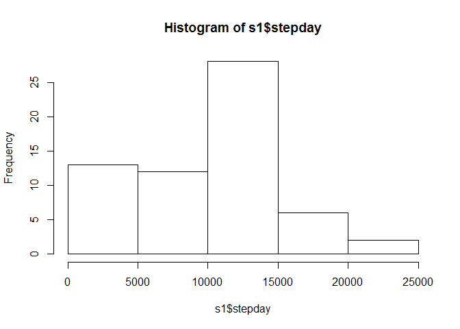
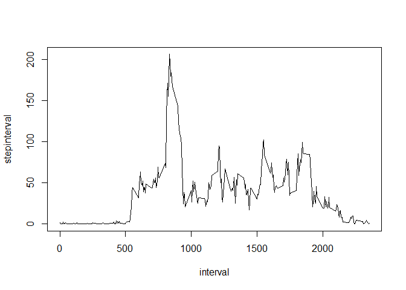
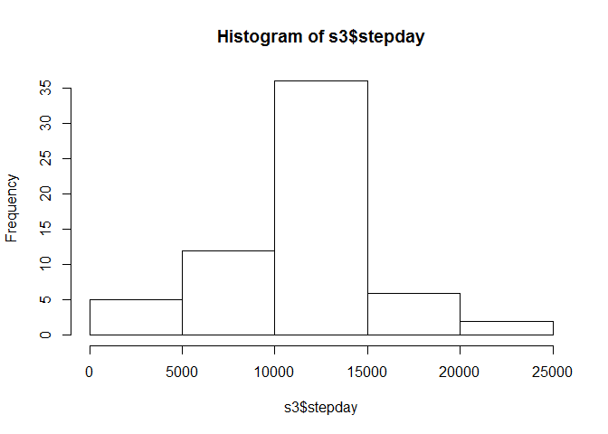
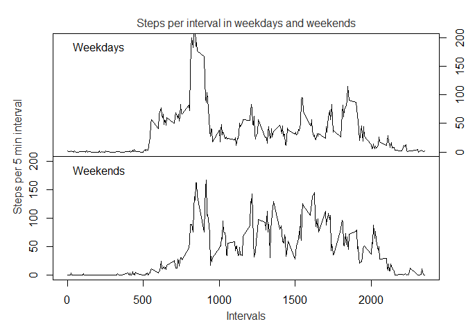

# Reproducible Research: Peer Assessment 1

## Part 1 - Loading and preprocessing the data
First read the data and take a look at it:

```r
temp <- "activity.zip"
if (!file.exists(temp)){
    fileURL <- "https://d396qusza40orc.cloudfront.net/repdata/data/activity.zip"
    download.file(fileURL, temp)
    }
step <- read.csv(unz(temp, "activity.csv"))

str(step)
```

```
## 'data.frame':	17568 obs. of  3 variables:
##  $ steps   : int  NA NA NA NA NA NA NA NA NA NA ...
##  $ date    : Factor w/ 61 levels "2012-10-01","2012-10-02",..: 1 1 1 1 1 1 1 1 1 1 ...
##  $ interval: int  0 5 10 15 20 25 30 35 40 45 ...
```
And then tidy it up (transform minutes in 4 digit string, create date+time column, and subset only the needed data):

```r
step2 <- transform(
      step, starttime=as.POSIXct(paste(step$date, sprintf("%04d",                                                       step$interval)),
                                       format="%Y-%m-%d %H%M"))[,c(4,1)]
str(step2)
```

```
## 'data.frame':	17568 obs. of  2 variables:
##  $ starttime: POSIXct, format: "2012-10-01 00:00:00" "2012-10-01 00:05:00" ...
##  $ steps    : int  NA NA NA NA NA NA NA NA NA NA ...
```


## Part 2 - What is mean total number of steps taken per day?

Using the original step data we can calculate the total number of steps taken each day using the summarise function (from dplyr package):


```r
s1 <- step %>%
      group_by(date) %>%
      summarize( stepday = sum(steps, na.rm=T))
```

And plot a simple histogram:


```r
hist(s1$stepday)
```

<!-- -->

And also calculate the mean and median:


```r
paste("Mean = ",mean(s1$stepday), "and Median = ", median(s1$stepday))
```

```
## [1] "Mean =  9354.22950819672 and Median =  10395"
```
## Part 3 - What is the average daily activity pattern?
In order to make the time series we will:  
*Factor the interval  
*Group by interval  
*Summarize creating the mean  

```r
s2 <- step %>%
      group_by(interval) %>%
      summarize( stepinterval = mean(steps, na.rm=T))
```

And then create the plot

```r
with(s2, plot(interval,stepinterval, type="l"))
```

<!-- -->

Now to find the interval with the maximum:

```r
s2[which.max(s2$stepinterval),]
```

```
## # A tibble: 1 × 2
##   interval stepinterval
##      <int>        <dbl>
## 1      835     206.1698
```

## Part 4 - Imputing missing values

All the NA values are in the variable steps, and the total number of incomplete observations is:

```r
sum(!complete.cases(step))
```

```
## [1] 2304
```

Now we will fill the NA values with the mean for that interval for the remaining days, and store it in a new data frame stepNNA

```r
stepNNA <- step
for (i in 1:length(stepNNA$steps)) {
   if(is.na(stepNNA$steps[i])) {
         stepNNA$steps[i] <- as.numeric(s2[s2$interval==step$interval[i],2])
   }   
}    
```
Now to have again the daily average for the corrected data:

```r
s3 <- stepNNA %>%
      group_by(date) %>%
      summarize( stepday = sum(steps, na.rm=T))
```

Again plot a simple histogram:


```r
hist(s3$stepday)
```

<!-- -->

And also calculate the mean and median:


```r
paste("Mean withoun NA= ",mean(s3$stepday), "and Median withoun NA= ", median(s3$stepday))
```

```
## [1] "Mean withoun NA=  10766.1886792453 and Median withoun NA=  10766.1886792453"
```

## Part 5 - Are there differences in activity patterns between weekdays and weekends?

As I live in a different locale, I will first create the match pattern based on a date:


```r
match <- c(weekdays(strptime("1975-12-6","%Y-%m-%d"),TRUE),
           weekdays(strptime("1975-12-7","%Y-%m-%d"),TRUE)) # saturday and sunday
```

Then, create the column with weekday/weekend in stepNNA:


```r
weekday <-  weekdays(strptime(stepNNA$date,"%Y-%m-%d"),TRUE)
weekday[!(weekday %in% match)] <- "weekday"
weekday[weekday %in% match] <- "weekend"
stepNNA <- data.frame(stepNNA,factor(weekday))
str(stepNNA)
```

```
## 'data.frame':	17568 obs. of  4 variables:
##  $ steps          : num  1.717 0.3396 0.1321 0.1509 0.0755 ...
##  $ date           : Factor w/ 61 levels "2012-10-01","2012-10-02",..: 1 1 1 1 1 1 1 1 1 1 ...
##  $ interval       : int  0 5 10 15 20 25 30 35 40 45 ...
##  $ factor.weekday.: Factor w/ 2 levels "weekday","weekend": 1 1 1 1 1 1 1 1 1 1 ...
```

The only thing missing is the data for the plot:


```r
s4 <- stepNNA %>%
      group_by(interval, factor.weekday.) %>%
      summarize( stepinterval = mean(steps, na.rm=T))
```

And then create the plot


```r
par(mfrow=c(2,1), mar=c(0,0,0,0), oma=c(4, 4, 2.5, 2))
with(s4[s4$factor.weekday.=="weekday",],
     plot(interval,stepinterval, type="l", yaxt='n', xaxt='n', ylim = c(0, 200)))
axis(4)
legend("topleft", legend = c("Weekdays"), bty = "n", 
                         pt.cex = 2, cex = 1, horiz = F)
with(s4[s4$factor.weekday.=="weekend",],
     plot(interval,stepinterval, type="l", ylim = c(0, 200)))
legend("topleft", legend = c("Weekends"), bty = "n", 
                         pt.cex = 2, cex = 1, horiz = F)
mtext("Steps per interval in weekdays and weekends",
      side = 3, outer = TRUE, cex = 1, line = 0.3,col = "grey20")
mtext("Intervals", side = 1, outer = TRUE, cex = 1, line = 2.2,col = "grey20")
mtext("Steps per 5 min interval", side = 2, outer = TRUE, cex = 1, line = 2.2,col = "grey20")
```

<!-- -->

We can see that during weekdays the activity begins earlier and is more intense until 10:00, but then it becomes lighter and ends earlier than on Weekends.
